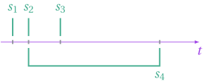
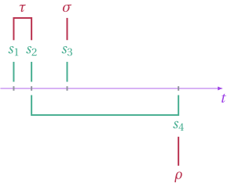
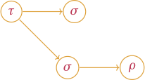
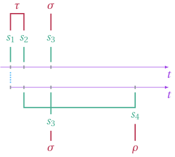
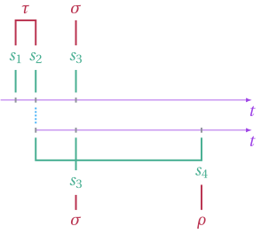

# Plumbing

We first go over a simple case where the need for a [`LoweredSchedule`](@ref) is apparent.

## Stopping Opportunity

First we recall that a stopping opportunity is a unit of decision. It is specified by a predicate and a list of timestamps. The predicate is simply a function that takes a collection of states and returns true or false. The states are sampled at each timestamp provided in the timestamps list. For instance, the following stopping opportunities
```julia
s_1 = StoppingOpportunity([0.0], (t,state_list) -> state_list[1].coord[1] > 0) 
s_2 = StoppingOpportunity([1.0], (t,state_list) -> true)
s_3 = StoppingOpportunity([4.0], (t,state_list) -> false)
s_4 = StoppingOpportunity([1.0,8.0], (t,state_list) -> state_list[1].coord[1] > state_list[2].coord[1])
```
Which could be visually represented as 

 

## Stopping time.


Next, we recall that a stopping time is simply a collection of stopping opportunities. The stopping opportunities are tested in chronological order and the first one to return true is used by the stopping time.

For instance, we could have
```julia
tau = StoppingTime([s_1,s_2])
sigma = StoppingTime([s_3])
rho = StoppingTime([s_4])
```
with the corresponding visualization



## Schedule

Now that we have our stopping times, we could define the following simple schedule
```julia
schedule = Schedule(tau, [Schedule(sigma), Schedule(sigma, [Schedule(rho)])])
```
with the following visual representation



## Sample

When it comes time to generate the sample,  whether or not the stopping time tau is triggered at s1 will have an impact on the timestamps each child process will have to sample. 

For instance, if tau is triggered at s1, we would have the following timelines.



In the above, two states will be have been sampled at s2. Whereas if tau is triggered at s_2, only one state will have been sampled at s1.




Because the number of timestamps might change from one iteration to the next, it makes it impractical to sample in place. However, many things don't change from one iteration to the next. The struct [`LoweredSchedule`](@ref) stores what is invariant across iterations.


# Road Map


* Improve the clarity and ease of the user interface for creating stopping opportunities and schedule. Clean up the interface.

* Improve the sampler's speed by better implementing some of the helper methods, e.g. find.

* Add the functionality of a fine-grained control over the random seeds.

