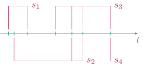
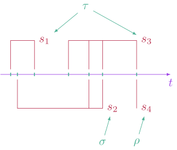
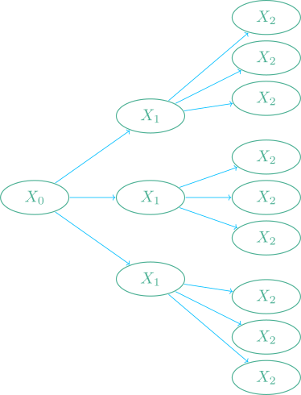
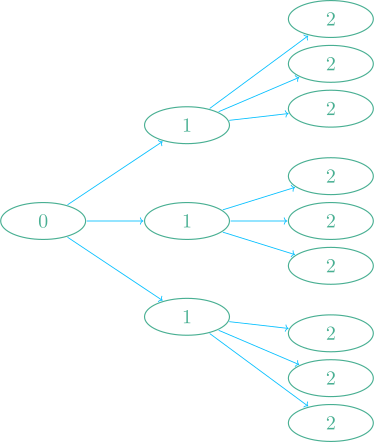
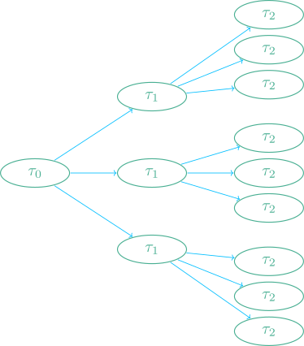
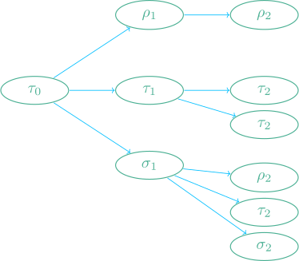
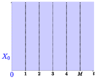

# InvariantStopping
* Explore how optimal stopping problems transform under random-time coordinate transforms. *

State encodes the information (e.g. coordinates) needed to specify the full configuration of the system.


## Stopping Opportunity

A stopping opportunity is a unit of decision. It is specified by a predicate and a list of timestamps. The predicate is simply a function that takes a collection of states and returns true or false. The states are sampled at each timestamp provided in the timestamps list. 



## Stopping time.

A stopping time is simply a collection of stopping opportunities. The stopping opportunities are tested in chronological order.



## Schedule

One can define a simple schedule such as
```julia
julia> schedule = Tree([0.0,1.0,2.0],3)
```
which amounts to sampling a ternary tree



The above sample has the following schedule



But this is just a specific instance of a more general schedule



A generic schedule could be for instance





## Lowered Schedule

We record the index corresponding to the first stopping opportunity that evalutes to true.

## Sample
