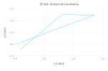
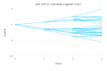
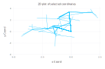
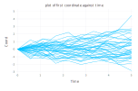
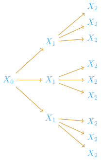
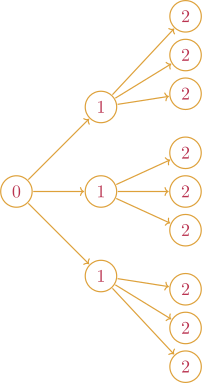
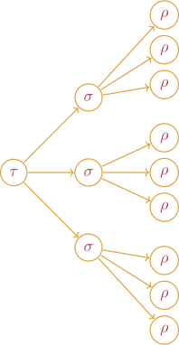
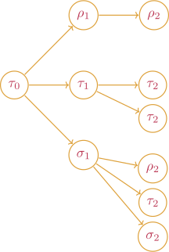

### State

### Schedule

### Process

We can increase the dimension of our state space. Consider for instance
```julia
state_4D = State((0.0,0.0,0.0,0.0))
sample_4D = Sample(state_4D, schedule, process) 
```
which samples a realization of a 4D Brownian motion. As opposed to plotting coordinate value against time, we can plot any pair of coordinates against each other. For instance
```julia
plot(sample_4D,[1,4])
```
produces a two dimensional plot where first coordinates are mapped onto the x axis and the fourth coordinates are mapped onto the y axis.



We can specify schedule with increasing complexity. 

```julia
tree_schedule = InvariantStopping.Tree([0.0,1.0,2.0,3.0],3);

tree_sample = Sample(state, tree_schedule, process);
plot(tree_sample)
```


And in 4D
```julia
ternary_sample_4D = Sample(state_4D, tree_schedule, process);
plot(ternary_sample_4D,[1,4]) # Plotting coordinate 1 against coordinate 4
```



Schedule accepts LinRange as well. For instance
```julia
star_schedule = InvariantStopping(Star(LinRange(0,5,10),40));
star_sample = Sample(state, star_schedule, process);
plot(star_sample)
```



## Schedule

Let's first take a look at the following

```julia
schedule = InvariantStopping.Tree([0,1,2],3)
sample = Sample(state, schedule, process)
```
This generates a tree of samples.



Note that the above tree can be interpreted as a tree of stopping times with deterministic stopping times.



These deterministic stopping times could be replaced by arbitary stopping times.



One can see that schedules can be made very general.



To craft our own schedule, we must first define a stopping time and the stopping opportunities it contained.


### Stopping Time and Stopping Opportunity

 For instance

```julia
function predicate_1(x,y) 
  return x - 2.0*y > 1.0
end

function predicate_2(x,y)
  return x + 1.0 > 0.5
end

stopping_time_1 = HittingTime(predicate_1, LinRange(0.0,10,20))
stopping_time_2 = HittingTime(predicate_2, LinRange(0.0,10,20))

schedule = Schedule(stopping_time_1, [Schedule(stopping_time_2)for _ in 1:10])

sample = Sample(state,schedule, underlying_model)
```

## Process